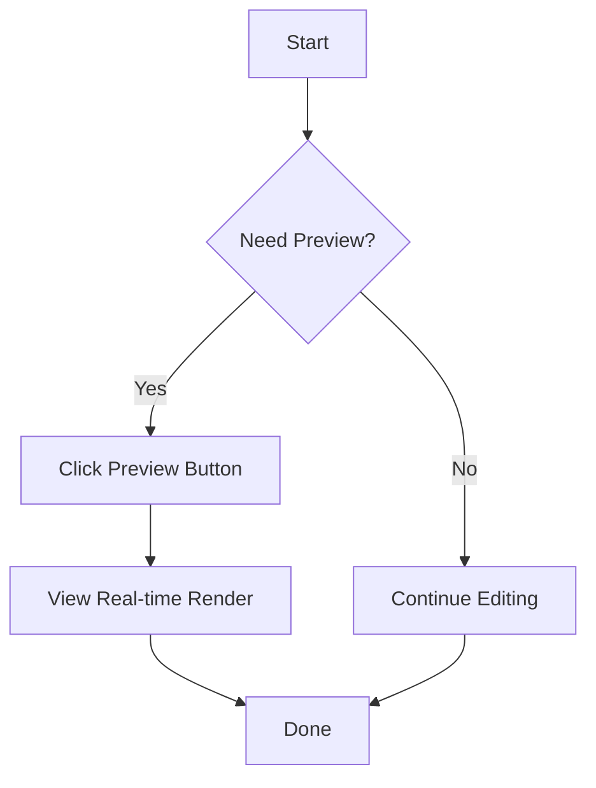

# Mermaid Graph

[中文文档](./README.zh-CN.md)

A powerful Mermaid diagram preview and syntax highlighting extension for Visual Studio Code with complete Mermaid support.

## ✨ Features

### 🎨 Syntax Highlighting

- Full syntax highlighting for `.mmd` and `.mermaid` files
- Mermaid code block syntax highlighting in Markdown
- Mermaid code block syntax highlighting in MDX
- Complete Mermaid syntax support including:
  - Flowchart
  - Sequence Diagram
  - Class Diagram
  - State Diagram
  - ER Diagram
  - Gantt Diagram
  - Git Graph
  - Pie Chart
  - User Journey
  - And more diagram types...

### 🔍 Real-time Preview

- One-click Mermaid diagram preview
- Real-time auto-update: preview refreshes automatically while editing (100ms debounce)
- Smart layout: preview panel automatically opens beside the editor
- Quick preview from editor title bar and context menu

### 🎯 Interactive Features

- **Zoom and Pan**: Use mouse wheel or trackpad to zoom diagrams
- **Pan Navigation**: Drag the diagram to view different areas
- **Auto-fit and Center**: Automatically fit and center when opening preview
- **Control Icons**: Built-in zoom control buttons

### 🚀 Quick Start

1. **Open a Mermaid file**: Create or open a `.mmd` or `.mermaid` file
2. **Preview the diagram**:
   - Click the eye icon (👁️) in the editor title bar
   - Or use Command Palette (`Cmd+Shift+P` / `Ctrl+Shift+P`) and search for `Mermaid Preview`
   - Or right-click in the editor and select `Mermaid Preview`
3. **Edit and view**: Preview updates automatically as you edit

### 📝 Example

Create a simple flowchart:

## 🔧 Requirements

- Visual Studio Code 1.80.0 or higher

## ⚙️ Extension Settings

This extension works out of the box with no additional configuration required. Preview functionality activates automatically when you open a Mermaid file.

## 🗺️ Roadmap

We're actively working on improving Mermaid Graph. Here's what's planned:

- 🚀 **Markdown Mermaid Preview**: Render Mermaid diagrams directly in Markdown preview
- 🎨 **Theme Support**: Configure and customize diagram themes
- 💾 **Export Feature**: Export diagrams as PNG, SVG, or PDF
- ⚡ **Performance Optimization**: Faster rendering for complex diagrams
- 🔄 **Live Collaboration**: Real-time diagram collaboration support

Have a feature request? [Let us know!](https://github.com/JsonLee12138/mmdx/issues)

## 🐛 Known Issues

No major known issues at this time. If you encounter any problems, please report them on [GitHub Issues](https://github.com/JsonLee12138/mmdx/issues).

## 📋 Release Notes

See [CHANGELOG.md](CHANGELOG.md) for detailed version update information.

### 0.0.1

Initial release:
- ✨ Mermaid syntax highlighting support
- 🔍 Real-time preview functionality
- 🎯 SVG zoom and pan interaction
- 📝 Support for Mermaid code blocks in Markdown and MDX

## 🤝 Contributing

Issues and Pull Requests are welcome!

## 📄 License

MIT

## 🔗 Links

- [GitHub Repository](https://github.com/JsonLee12138/mmdx)
- [Mermaid Official Documentation](https://mermaid.js.org/)
- [VSCode Marketplace](https://marketplace.visualstudio.com/)

---

**Enjoy using Mermaid Graph!** 🎉
