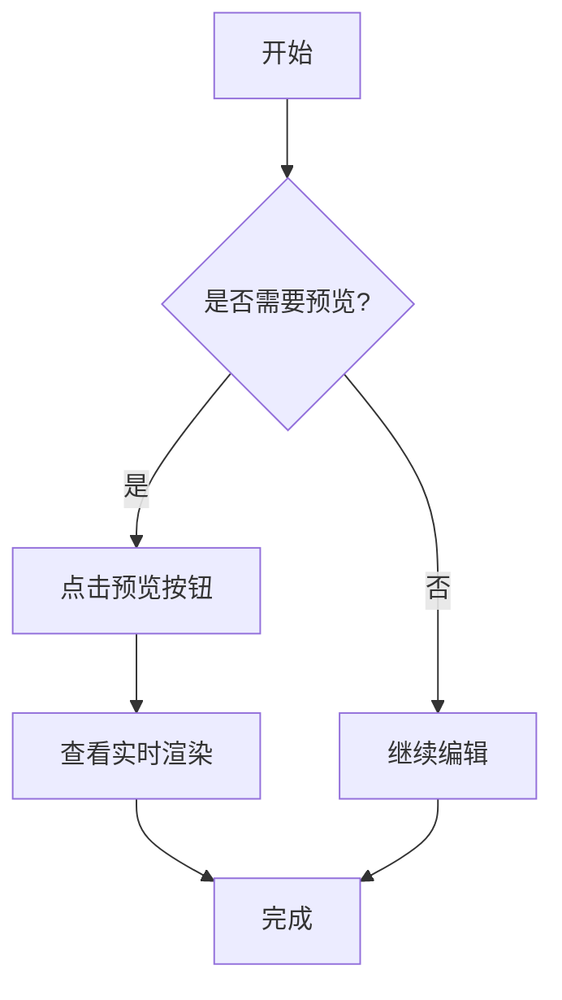

# Mermaid Graph

[English Document](https://github.com/JsonLee12138/mermaid-graph/blob/main/README.md)

一个强大的 Mermaid 图表预览和语法高亮扩展，为 Visual Studio Code 提供完整的 Mermaid 支持。

## ✨ 功能特性

### 🎨 语法高亮

- 支持 `.mmd` 和 `.mermaid` 文件的完整语法高亮
- 支持 Markdown 中的 Mermaid 代码块语法高亮
- 支持 MDX 中的 Mermaid 代码块语法高亮
- 完整的 Mermaid 语法支持，包括：
  - 流程图（Flowchart）
  - 序列图（Sequence Diagram）
  - 类图（Class Diagram）
  - 状态图（State Diagram）
  - 实体关系图（ER Diagram）
  - 甘特图（Gantt Diagram）
  - Git 图（Git Graph）
  - 饼图（Pie Chart）
  - 用户旅程图（User Journey）
  - C4 图表（C4 Context、Container、Component、Dynamic、Deployment）
  - 以及更多图表类型...

### 🔍 实时预览

- 一键预览 Mermaid 图表
- 实时自动更新：编辑时预览会自动刷新（100ms 防抖）
- 智能布局：预览面板自动在编辑器旁边打开
- 支持编辑器标题栏和右键菜单快速预览

### 🎯 交互功能

- **缩放和平移**：使用鼠标滚轮或触控板缩放图表
- **平移导航**：拖动图表查看不同区域
- **自适应居中**：打开预览时自动适配和居中显示
- **控制图标**：内置缩放控制按钮

### 🚀 快速开始

1. **打开 Mermaid 文件**：创建或打开 `.mmd` 或 `.mermaid` 文件
2. **预览图表**：
   - 点击编辑器右上角的眼睛图标（👁️）
   - 或使用命令面板（`Cmd+Shift+P` / `Ctrl+Shift+P`）搜索 `Mermaid Preview`
   - 或在编辑器中右键选择 `Mermaid Preview`
3. **编辑和查看**：预览会随着你的编辑自动更新

### 📝 示例

创建一个简单的流程图：

## 🔧 系统要求

- Visual Studio Code 1.80.0 或更高版本

## ⚙️ 配置说明

该扩展开箱即用，无需额外配置。预览功能会在你打开 Mermaid 文件时自动激活。

## 🗺️ 开发计划

我们正在积极改进 Mermaid Graph。以下是计划中的功能：

- 🚀 **Markdown Mermaid 预览**：在 Markdown 预览中直接渲染 Mermaid 图表
- 🎨 **主题支持**：配置和自定义图表主题
- 💾 **导出功能**：将图表导出为 PNG、SVG 或 PDF
- ⚡ **性能优化**：更快地渲染复杂图表
- 🔄 **实时协作**：支持实时图表协作

有功能建议？[告诉我们！](https://github.com/JsonLee12138/mermaid-graph/issues)

## 🐛 已知问题

目前暂无已知的重大问题。如果你遇到任何问题，请在 [GitHub Issues](https://github.com/JsonLee12138/mermaid-graph/issues) 中报告。

## 📋 更新日志

查看 [CHANGELOG.md](CHANGELOG.md) 了解详细的版本更新信息。

### 0.0.1

初始版本发布：
- ✨ Mermaid 语法高亮支持
- 🔍 实时预览功能
- 🎯 SVG 缩放和平移交互
- 📝 支持 Markdown 和 MDX 中的 Mermaid 代码块

## 🤝 贡献

欢迎提交 Issue 和 Pull Request！

## 📄 许可证

MIT

## 🔗 相关链接

- [GitHub 仓库](https://github.com/JsonLee12138/mermaid-graph)
- [Mermaid 官方文档](https://mermaid.js.org/)
- [VSCode 扩展市场](https://marketplace.visualstudio.com/)

---

**享受使用 Mermaid Graph！** 🎉
