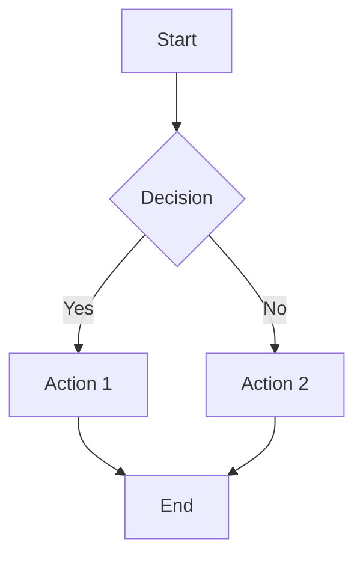
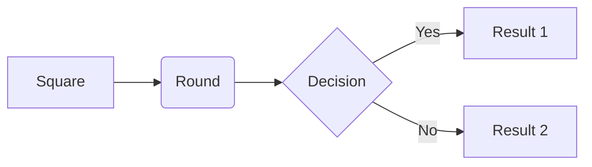
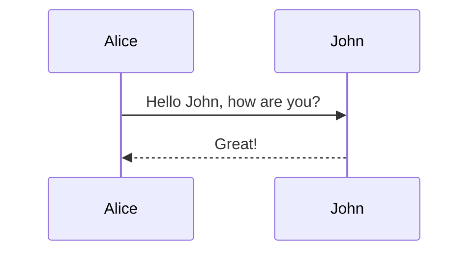
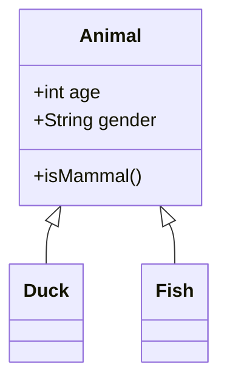
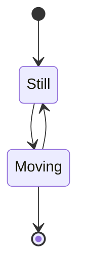
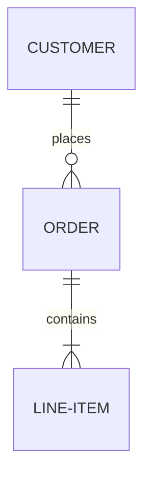
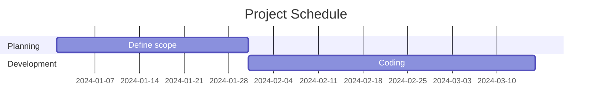
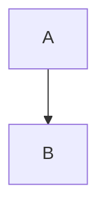

# Getting Started with Mermaid Graph

Welcome to Mermaid Graph! This guide will help you get started with creating and previewing beautiful Mermaid diagrams in Visual Studio Code.

## 📦 Installation

1. Open Visual Studio Code
2. Press `Ctrl+Shift+X` (Windows/Linux) or `Cmd+Shift+X` (macOS) to open the Extensions view
3. Search for "Mermaid Graph"
4. Click **Install**

Alternatively, install from the [VSCode Marketplace](https://marketplace.visualstudio.com/).

## 🚀 Quick Start

### Creating Your First Mermaid Diagram

1. **Create a new file** with a `.mmd` or `.mermaid` extension
   - Example: `flowchart.mmd`

2. **Write your Mermaid code**. Here's a simple flowchart example:

3. **Preview the diagram**:
   - Click the eye icon (👁️) in the editor title bar
   - Or press `Ctrl+Shift+P` / `Cmd+Shift+P` and type "Mermaid Preview"
   - Or right-click in the editor and select "Mermaid Preview"

4. **See the result!** A preview panel will open beside your editor showing the rendered diagram.

## 🎨 Features

### Real-time Preview
The preview automatically updates as you type (with a 100ms debounce for smooth performance).

### Interactive Viewing
- **Zoom**: Use mouse wheel or trackpad to zoom in/out
- **Pan**: Click and drag to move around the diagram
- **Reset**: Use the control buttons to reset view

### Syntax Highlighting
Enjoy full syntax highlighting for:
- `.mmd` and `.mermaid` files
- Mermaid code blocks in Markdown files
- Mermaid code blocks in MDX files

## 📝 Supported Diagram Types

Mermaid Graph supports all Mermaid diagram types:

### Flowchart

### Sequence Diagram

### Class Diagram

### State Diagram

### ER Diagram

### Gantt Chart

And many more! See the [Mermaid documentation](https://mermaid.js.org/) for all diagram types.

## 💡 Tips and Tricks

### 1. Use in Markdown Files
You can write Mermaid diagrams in Markdown code blocks:

~~~markdown

~~~

The extension provides syntax highlighting for these blocks!

### 2. Command Palette
Access all commands quickly:
- `Ctrl+Shift+P` / `Cmd+Shift+P` → type "Mermaid"

### 3. Multiple Diagrams
You can have multiple diagram files open and preview them individually.

### 4. Side-by-Side Editing
The preview automatically opens in a split view, so you can edit and view simultaneously.

## 🔧 Troubleshooting

### Preview Not Showing
- Make sure the file has a `.mmd` or `.mermaid` extension
- Try closing and reopening the preview
- Check the Developer Console for errors: `Help` → `Toggle Developer Tools`

### Syntax Errors
If your diagram doesn't render:
- Check the Mermaid syntax in the [official documentation](https://mermaid.js.org/)
- Look for error messages in the preview panel
- Validate your syntax using the [Mermaid Live Editor](https://mermaid.live/)

### Performance Issues
For very complex diagrams:
- Try breaking them into smaller diagrams
- Reduce the number of nodes and connections
- Consider simplifying the diagram structure

## 📚 Learning Mermaid

New to Mermaid? Here are some resources:

- [Official Mermaid Documentation](https://mermaid.js.org/)
- [Mermaid Live Editor](https://mermaid.live/) - Test your diagrams online
- [Mermaid Tutorial](https://mermaid.js.org/intro/)

## 🐛 Reporting Issues

Found a bug or have a feature request?

1. Visit our [GitHub Issues](https://github.com/JsonLee12138/mmdx/issues)
2. Search for existing issues
3. Create a new issue with:
   - Clear description
   - Steps to reproduce
   - Expected vs actual behavior
   - Screenshots if applicable

## 🤝 Contributing

We welcome contributions! Check out our [GitHub repository](https://github.com/JsonLee12138/mmdx) to get started.

## 🔗 Useful Links

- [Mermaid Official Site](https://mermaid.js.org/)
- [VSCode Extension API](https://code.visualstudio.com/api)
- [GitHub Repository](https://github.com/JsonLee12138/mmdx)

---

**Happy diagramming!** 🎉

For more detailed information, see the [README](./README.md).
